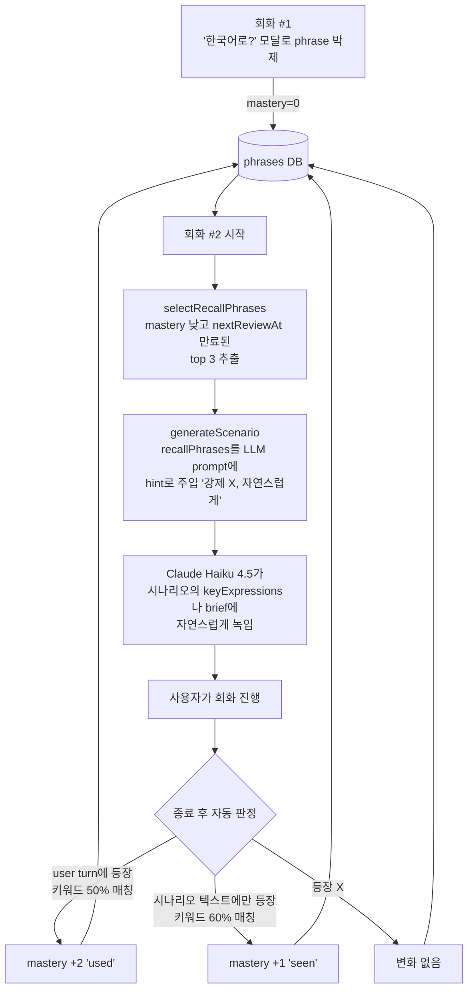
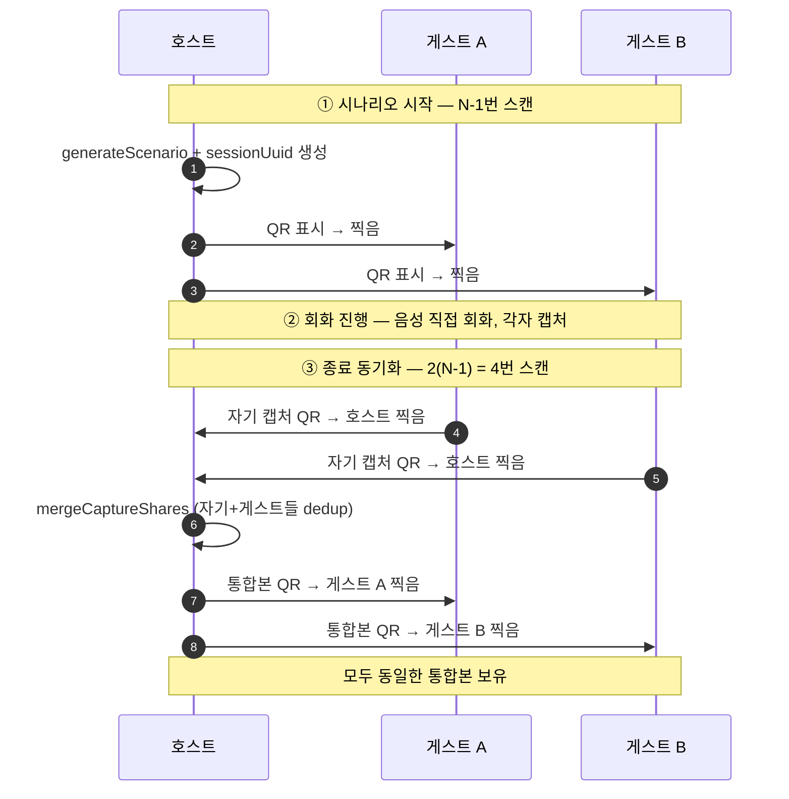
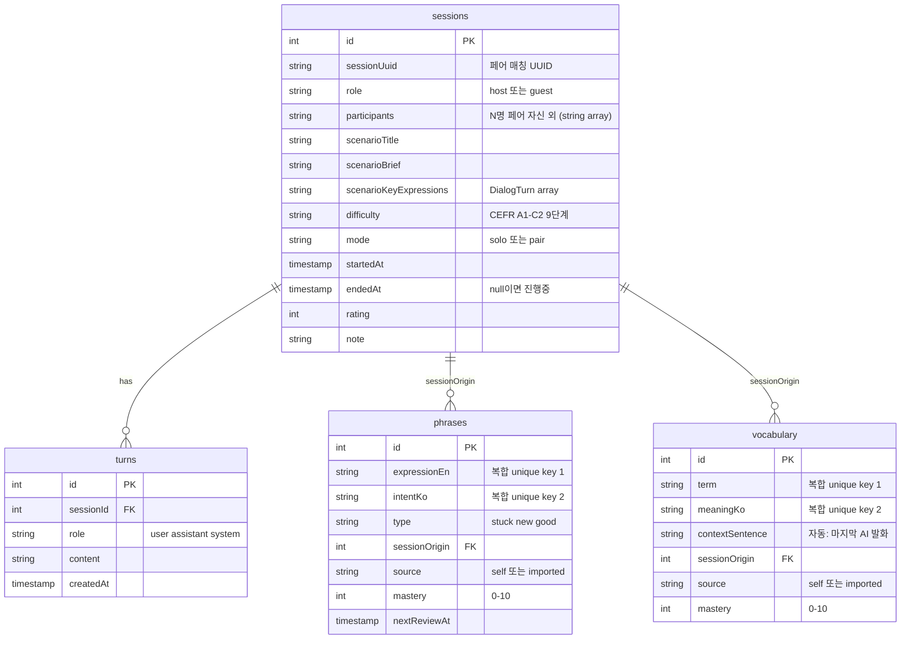

<div align="center">

# convo·trace ✦

**회화의 흔적을 따라가는 영어 회화 학습 박제 도구**

> 시나리오 받고 회화하는 것보다, 그 안에서 발생하는 학습 모먼트를 박제하는 게 본질.

🔗 **Live**: https://saga-tales.github.io/tale-02-convo-trace-iq/
📁 **Repo**: https://github.com/Saga-Tales/tale-02-convo-trace-iq
🌌 **Studio**: [Saga-Tales](https://github.com/Saga-Tales) — venture studio의 두 번째 tale

</div>

---

## 한 문단으로

ChatGPT나 Claude로 영어 회화를 해본 적 있다면 알 거다 — 회화는 즐거운데 끝나면 다 휘발된다. "한국어로 X를 영어로 어떻게?" 질문도, 모르는 단어 lookup도, AI가 사용한 좋은 표현도, 다 그 채팅창 안에서 사라진다. **convo·trace**는 회화 도중 발생하는 모든 학습 모먼트를 컨텍스트와 함께 박제하고, 박제된 표현이 **다음 회화에 자연스럽게 다시 등장하도록** 하는 폐쇄 루프 학습 도구. BYOK + 백엔드 0대 + 브라우저 안에 모든 게 산다.

## 페인 4가지 → 해결 매핑

회화 도구는 많지만 학습 모먼트 박제는 사각지대다. 직접 dogfooding 하면서 발견한 페인 4가지:

| # | 페인 | 어떻게 풀었나 | 어디 살아남나 |
|---|---|---|---|
| 1 | "한국어로 X를 영어로 어떻게?" 짧은 답이 필요한데 회화 흐름 끊기 싫음 | **한국어로? 모달** — 모달에서 짧은 영어 답변 받고 자동 phrase 저장 + 입력창에 채워줌 | `phrases` 테이블 |
| 2 | 회화 중 모르는 단어가 나옴 — lookup 하면 흐름 끊김 | **단어 뜻 모달** — 마지막 AI 발화를 contextSentence로 자동 저장 (단어가 어떤 문맥에서 나왔는지) | `vocabulary` 테이블 |
| 3 | AI가 사용한 좋은 표현 — 그 순간엔 인지하지만 회화 끝나면 다 잊어버림 | **회화 종료 후 자동 추출** — Claude가 transcript에서 좋은 표현 8개 뽑아 keep/discard UI로 큐레이션 | `phrases` 테이블 (type='good') |
| 4 | **박제해도 다음에 안 떠오름** — 의식적 review 없으면 학습 누적 안 됨 | **회상 폐쇄 루프** — 다음 시나리오 생성 시 mastery 낮은 phrase를 LLM prompt에 hint로 주입. 사용자가 회화에서 그 표현을 만나면(seen) 또는 사용하면(used) mastery 자동 업데이트 | mastery 0–10 + `nextReviewAt` |

핵심 차별화는 **페인 4번**. 다른 도구는 1–3번까지는 부분적으로 풀지만, "박제한 게 자연스럽게 다시 만나는" 폐쇄 루프는 없다.

---

## 회상 폐쇄 루프 (핵심 메커니즘)



**왜 이 설계인가**:

- **substring keyword match**로 mastery 판정 — LLM 호출 추가 안 함. 4글자 이상 키워드의 50% (used) / 60% (seen) 매칭이면 충분히 신호 잡힘. 비용·지연 X.
- **너무 최근에 캡처된 건 회상 후보에서 제외** (1시간 이내) — 같은 회화에서 박제한 걸 또 등장시키면 부자연.
- **SM-2 단순화** — 정통 SM-2의 ef + interval + repetitions는 게임화 부담. mastery 0–10 단일 스케일로 단순화. nextReviewAt = `now + mastery * intervalFactor`. 마스터된 건 회상 큐에서 자연스럽게 빠짐.
- **명시적 review UI 없음** — 자동 폐쇄 루프가 본질. 회상 큐 보여주는 것보다 "다음 회화에 자연스럽게 등장"이 더 학습 효과적.
- **별도 "한 주 누적 리뷰" 페이지 안 만듦** — 회상 시스템이 이미 누적 리뷰 역할. 사용자가 의식적으로 review 페이지 들어가서 학습하라고 강제하는 건 회상 폐쇄 루프 본질에 어긋남.

홈에 **"다음 회화에서 만날 표현"** 카드 — 사용자가 "지금 학습 중인 게 곧 다시 만난다"는 신뢰 형성.

---

## 솔로 vs 페어 모드

### 솔로 (AI와 1:1)
시나리오 받고 Claude Haiku 4.5와 streaming 회화. 캡처 도구 (한국어로?, 단어 뜻) 인라인. 종료 후 자동 표현 추출 + mastery 업데이트.

### 페어 (N명 직접 만남)
우테코 동아리 영어 회화 스터디 멤버끼리 직접 음성 회화. AI는 시나리오만 만들고 회화 자체는 사람 사이. 디바이스는 캡처 + 동기화 역할. 2명·3명·4명 모두 동일 코드 경로 (`participants: string[]`로 일반화).

#### 시나리오 분량 — 상황별 자율성

페어 시나리오는 **상황·카테고리·맥락에 자연스러운 분량**으로 LLM이 자율 결정 (8-50 turns). Cookie cutter 강제 X:

| 상황 | 자연스러운 분량 |
|---|---|
| 거래성 회화 (쇼핑·식당·점원) | 10-20 turns, 명확한 단계 |
| 인사·짧은 만남 | 10-15 turns |
| 친구 카페 잡담 | 20-35 turns, 자유로운 흐름 |
| 면접·인터뷰 | 25-40 turns, 한쪽이 주로 질문 |
| 깊은 토론·storytelling | 35-50 turns, 후속 질문 깊게 |
| 비즈니스 협상·미팅 | 25-40 turns, 입장 차이 |

긴 회화 (20+ turns) 에는 4 phase 구조 (Opening → Main → Development → Closing) 가 자연스럽게 보이도록 `ScenarioPreview`에서 phase 마커 자동 표시. 짧은 거래 회화는 마커 없이 깔끔하게 나열.

사용자가 hint에 "쇼핑 짧게 / 깊은 토론 / 면접 인터뷰" 같은 자연어로 분량 의도 표현 가능.

#### 동아리 4단계 진행 가이드

`PairSessionView`에 collapsible 카드 — 동아리 표준 진행 방식 직접 반영:

```
① 표현 연습 (3-4분)    — 시나리오 keyExpressions 함께 보며 핵심 표현
② 상황극 진행 (3-4분)  — 한 명이 [userRole], 다른 명이 [aiRole]
③ 역할 바꿔서 (3-4분)  — 같은 시나리오 반대 입장
④ 추가 상황 (선택)     — plot twist 추가 후 ②③ 반복
⑤ 마무리 (5분)         — 잘 쓴 표현 정리, 캡처 도구 활용
```

각 단계 클릭 시 체크박스 동작, 진행도 표시. 시나리오의 실제 `userRole` / `aiRole`이 ②번에 자동 삽입.

#### 페어 동기화 — 호스트 중심 모델

처음에 양방향 P2P를 고려했지만 N(N−1)번 스캔이라 3명 시 6번. 호스트 중심으로 가면 **2(N−1) + (N−1) = 3(N−1)번** — 그 중 회화 시작 전 (N−1)번은 자연스럽고, 종료 동기화는 **2(N−1)번**.



#### QR 페이로드 — 4KB 한도 내 압축

QR 한 장은 알파뉴메릭 ECC L 기준 ~4KB. 그냥 JSON 넣으면 시나리오 1개 + 캡처 10개 = ~4.5KB로 한계 넘김. 처리:

```
JSON  →  pako gzip (압축률 ~1/3)  →  base64  →  'CT1' magic prefix
```

- 시나리오 1개: raw 1.5KB → 압축 후 ~600B
- 캡처 (phrases 5 + vocab 5): raw 3KB → 압축 후 ~1.2KB

`MAX_ITEMS=50`으로 cap, 형식 validator가 magic prefix · 길이 · 필드 모두 검증. `sessionUuid` 매칭으로 다른 회화 QR 잘못 찍는 거 방지. 받은 share는 `[expressionEn+intentKo]` 복합 unique 인덱스로 dedup, `source='imported'` 마킹.

---

## 데이터 모델



### Dexie 스키마 마이그레이션

| 버전 | 변경 | 마이그레이션 |
|---|---|---|
| v1 | 초기 — sessions, turns, vocabulary, phrases, scenarios | — |
| v2 | difficulty `beginner/intermediate/advanced` → CEFR `A1`–`C2` | 자동 매핑 |
| v3 | scenarioKeyExpressions `string[]` → `DialogTurn[]` | 기존을 모두 `speaker:'partner'`로 변환 |
| v4 | sessionUuid 인덱스 + role + participants 추가 | 기존 페어 세션 `partnerName` → `participants=[partnerName]` + `role='host'` |

### 복합 unique 인덱스 (dedup)

```typescript
phrases: '++id, &[expressionEn+intentKo], capturedAt, nextReviewAt, mastery, type'
vocabulary: '++id, &[term+meaningKo], capturedAt, nextReviewAt, mastery'
```

`&` prefix로 unique 강제 — 같은 phrase/vocab 두 번 박제하면 자동 reject. 페어 동기화의 import도 이 인덱스로 dedup.

---

## 디렉토리 구조

```
src/
├── App.tsx                       # 라우터 + nav (로고 → 홈)
├── main.tsx                      # React entry, ErrorBoundary, basename
├── index.css                     # Tailwind v4 + 디자인 토큰 v2
│
├── db/schema.ts                  # Dexie v4 + 마이그레이션
│
├── lib/
│   ├── anthropic.ts              # BYOK + callOnce + callStreaming
│   ├── scenario.ts               # generateScenario + recallPhrases 주입 + hard-constraint validator
│   ├── conversation.ts           # startSession (sessionUuid/role/participants) + endSession
│   ├── capture.ts                # askKoToEn + lookupWord (Day 3 캡처)
│   ├── extractor.ts              # 회화 종료 후 자동 표현 추출 (Day 4)
│   ├── recall.ts                 # selectRecallPhrases + checkPhraseUsedInTurns + checkPhraseSeenInScenario + calculateStreak + masteryDistribution (Day 5)
│   ├── srs.ts                    # SM-2 단순화 — applyReview + reviewPhrase + masteryLabel (Day 5)
│   ├── share.ts                  # QRPayload + pako gzip + base64 + magic 'CT1' + validators (Day 6)
│   ├── sync.ts                   # mergeCaptureShare — 받은 share를 자기 DB dedup 머지 (Day 6)
│   ├── backup.ts                 # JSON export/import + Merge/Replace 모드 + schemaVersion 호환성 (Day 7)
│   └── profile.ts                # 닉네임 (localStorage)
│
├── components/
│   ├── ApiKeyGate.tsx            # API 키 없으면 입력 강제
│   ├── ErrorBoundary.tsx
│   ├── ScenarioSetup.tsx         # 모드/난이도/카테고리/페어 참여자 입력
│   ├── ScenarioPreview.tsx       # 시나리오 미리보기 + 호스트면 'QR 공유' 버튼
│   ├── ScenarioPanel.tsx         # 회화 중 collapsible 시나리오 가이드
│   ├── ChatView.tsx              # 솔로 회화 — streaming + 캡처 도구 인라인
│   ├── PairSessionView.tsx       # 페어 회화 — 캡처 도구만, 음성은 직접
│   ├── SessionEndDialog.tsx      # rating + note
│   ├── ExtractionResults.tsx     # 자동 추출 표현 keep/discard UI
│   ├── AskKoreanModal.tsx        # 페인 1
│   ├── WordLookupModal.tsx       # 페인 2
│   ├── QRCodeView.tsx            # canvas + qrcode lib + byte length 표시
│   ├── QRScanner.tsx             # qr-scanner + env camera
│   ├── ShareScenarioModal.tsx    # 호스트 시나리오 QR
│   ├── JoinByQRModal.tsx         # 게스트 QR 스캔 + 미리보기
│   ├── PairSyncModal.tsx         # 호스트(collecting/broadcasting/done) + 게스트(sending/receiving/done) 멀티 step
│   └── BackupSection.tsx         # Settings에서 사용 — export/import UI
│
└── pages/
    ├── Home.tsx                  # 스트릭 + 회상 예고 + mastery 분포 bar + 최근 회화
    ├── Chat.tsx                  # 호스트/게스트 흐름 분기 + state machine
    ├── Sessions.tsx              # 전체 회화 기록 (페어·호스트·N명 표시)
    ├── Vocab.tsx                 # 표현·단어 탭 + mastery 라벨
    └── Settings.tsx              # 닉네임 + API 키 + 백업 + PWA 설치 가이드
```

---

## Tech stack

### 핵심

| 영역 | 선택 | 이유 |
|---|---|---|
| Build | **Vite 5** | 빠른 dev, 정적 빌드, GH Pages 친화 |
| Framework | **React 18 + TypeScript** | 타입 안정성, hooks 기반 state |
| Styling | **Tailwind v4** | `@theme` 패턴 + 디자인 토큰, 작은 빌드 |
| Storage | **Dexie 4** (IndexedDB) | 브라우저 NoSQL, 트랜잭션, 복합 인덱스, 마이그레이션 |
| LLM | **Anthropic Claude Haiku 4.5** (`claude-haiku-4-5-20251001`) | 한국어 가성비, streaming, 시나리오/추출에 충분 |
| Routing | **React Router 6** | client-side, basename 지원 |
| Hosting | **GitHub Pages** | 무료, public, 자동 배포 |

### Day 6–7 추가

| 영역 | 선택 | 용도 |
|---|---|---|
| QR 생성 | **qrcode** | canvas 렌더, ECC level M |
| QR 스캔 | **qr-scanner** | env camera, worker 기반 |
| 압축 | **pako 2** (gzip) | QR 페이로드 ~1/3 압축 |
| PWA | **vite-plugin-pwa** (Workbox) | precache + 캐시 전략 + manifest 자동 생성 |

### 빌드 사이즈 (Day 7 시점)

```
dist/index.html                   2.23 kB │ gzip:   1.11 kB
dist/assets/index-*.css          24.61 kB │ gzip:   5.41 kB
dist/assets/index-*.js          506.36 kB │ gzip: 161.58 kB
dist/assets/qr-scanner-worker   43.95 kB │ gzip:  10.46 kB
dist/sw.js                       (Workbox SW)
dist/manifest.webmanifest         0.58 kB
PWA precache: 18 entries (613.73 KiB)
```

---

## 디자인 시스템 v2

7일 사이클 중 Day 4에 디자인 리뉴얼. 초기 cream + deep teal에서 vibrant pink primary로 — 영어 회화 학습이 무거운 도구가 아니라 즐거운 박제 활동임을 시각화.

### 컬러 토큰

| 토큰 | 값 | 용도 |
|---|---|---|
| `--color-bg` | `#fff8ee` | warm cream — 메인 배경 |
| `--color-bg-soft` | `#fef3e0` | 카드 sub 배경 |
| `--color-ink` | `#1a1a1a` | 본문 텍스트 |
| `--color-ink-soft` | `#7a7a7a` | 캡션, hint |
| `--color-accent` | `#ec4899` | **vibrant pink — primary** (액션, 강조) |
| `--color-accent-soft` | `#fce7f3` | pink 흐림 (호버, 보조) |
| `--color-teal` | `#14787e` | **deep teal — secondary** (보조 강조) |
| `--color-pop` | `#38bdf8` | sky blue — pop accent |
| `--color-highlight` | `#fff070` | vibrant yellow — 형광펜 (캡처 마킹) |
| `--color-warn` | `#dc2626` | 경고 (Replace 백업, 검증 실패) |
| `--color-line` | `#e7e0d0` | 보더 |

### 타이포그래피

| 토큰 | 값 | 용도 |
|---|---|---|
| `--font-display` | `Fraunces` italic | 페이지 타이틀, 강조 (시그니처 italic 분위기) |
| `--font-body` | `Pretendard Variable` | 한국어 first 본문 |

### 시그니처 요소

- **`✦` sig-star** — 헤더 + 카드 타이틀 prefix. convo·trace 정체성.
- **gradient-card** 클래스 (3종) — pink gradient (primary), teal gradient (secondary), warm gradient (notice)
- **rounded-2xl** — 모서리 일관, 카드는 모두 `rounded-2xl`
- **lift hover** — 카드 hover 시 `translateY(-2px)` + `shadow-md`
- **animate-pop-in** — 모달/토스트 등장
- **highlight** 클래스 — 형광펜 효과 (yellow 배경 + 살짝 기울어진 그림자)

### 로고

```
convo·trace
^^^^^ ^^^^^
teal  pink
```

`convo`는 deep teal, `trace`는 vibrant pink. 두 색의 mix로 sibling 보존하면서 primary 강조.

---

## Privacy & Storage Architecture

> **모든 데이터는 너의 브라우저에만 산다.**

### 어디 저장되나

| 데이터 | 위치 | 비고 |
|---|---|---|
| API 키 | localStorage | `convo-trace-api-key` |
| 닉네임 | localStorage | `convo-trace-nickname` |
| 활성 세션 ID | localStorage | 회화 중 새로고침 시 복구 |
| 회화 기록, 표현, 단어, 시나리오 | IndexedDB | Dexie v4 schema |

### 무엇이 외부로 나가나

- **Anthropic API** — 시나리오 생성, 회화 streaming, 단어 lookup, 표현 추출 시점에 메시지가 `api.anthropic.com`으로 일시 전송. 응답 받고 끝. ([Anthropic 데이터 정책](https://www.anthropic.com/privacy))
- **Google Fonts CDN** — Fraunces 폰트
- **jsdelivr CDN** — Pretendard Variable 폰트

그 외에는 아무것도 외부로 안 나간다. **백엔드 서버 없음, 분석/트래킹 없음, 광고 없음.**

### BYOK 의미

Bring Your Own Key — Anthropic API 키를 사용자가 직접 발급받아 입력. 의미:

- 비용은 사용자가 직접 부담 (보통 $5 충전이면 한 달 사용 가능)
- 키는 이 브라우저에만 저장됨 — 다른 디바이스/브라우저에서는 새로 입력 필요
- IQ가 사용자의 회화를 볼 방법이 없음 (백엔드가 없으므로)

### 휘발성 대비 — JSON 백업

브라우저 캐시 삭제, 디바이스 변경, IndexedDB 손상에 대비해 JSON 백업/복원 (Day 7).

| 모드 | 동작 | 사용 케이스 |
|---|---|---|
| **Merge** (안전, 기본) | 기존 데이터 유지 + 백업과 dedup 머지 | 두 디바이스 합치기 |
| **Replace** (위험) | 모두 삭제 후 백업으로 교체 + sessionId 재매핑 | 새 디바이스에 그대로 옮기기 |

`schemaVersion`으로 forward compat 검증 — 더 새로운 버전 백업은 reject.

### PWA 설치

`vite-plugin-pwa` (Workbox 기반) — Day 7 추가.

- **Precache**: 모든 JS/CSS/HTML/font/icon (18 entries, 613KB)
- **Anthropic API**: `NetworkOnly` — 절대 캐시 X
- **Google Fonts / jsdelivr CDN**: `CacheFirst` (1년 / 90일)

오프라인일 때:
- ✓ 가능: 시나리오·캡처 보기, /vocab /sessions 탐색, JSON export
- ✗ 불가능: 새 시나리오 생성, 솔로 회화, 캡처 모달 (Anthropic 호출)

iOS Safari · Android Chrome · Desktop Chrome/Edge에서 "홈 화면에 추가" 가능.

---

## 빠른 시작

### 사용자 입장

1. [Live 사이트](https://saga-tales.github.io/tale-02-convo-trace-iq/) 접속
2. [console.anthropic.com](https://console.anthropic.com)에서 API 키 발급 (보통 $5 충전이면 한 달 사용 가능)
3. **설정** → API 키 입력 + 닉네임 입력
4. **회화** → 모드 / 난이도 (CEFR 9단계) / 카테고리 선택 → 시나리오 생성 → 시작
5. (선택) **설정** → "홈 화면에 추가"로 PWA 설치

### 개발자 입장

요구사항: **Node 20+**

```bash
git clone https://github.com/Saga-Tales/tale-02-convo-trace-iq
cd tale-02-convo-trace-iq
npm install      # .npmrc에 ignore-scripts=true (native binary 스킵)
npm run dev      # http://localhost:5173/tale-02-convo-trace-iq/
```

빌드:

```bash
npm run build    # dist/ 정적 파일 + sw.js + manifest.webmanifest 생성
npm run preview  # 빌드 결과 로컬 확인
```

`main` 브랜치 push 시 GitHub Actions가 자동 배포.

### 페어 모드 dogfooding

페어 모드 + QR 동기화는 https + 카메라 권한 필요. 로컬에서 테스트 시:

```bash
npm run dev -- --host  # LAN IP로 접속
# 폰에서 https://<your-ip>:5173/tale-02-convo-trace-iq/
# (인증서 경고 무시하고 진행)
```

또는 배포된 https 환경에서 직접 테스트.

---

## 7일 사이클 + 마이크로 fix

Saga-Tales venture studio의 vibe-coding 방법론으로 진행. 매일 한 사이클 완료 + zip + commit + push.

### 초기 7일 (기능 완성)

| Day | 핵심 |
|---|---|
| 1 | 골격 — Vite + React + TypeScript + Tailwind v4 + IndexedDB schema + BYOK + GH Pages 자동 배포 + SPA fallback |
| 2 | 시나리오 + 회화 — Claude Haiku 4.5 + hard-constraint validator + streaming + CEFR 9단계 + 풍부한 시나리오 |
| 3 | 캡처 (페인 1·2) — ko→en 모달 + 단어 lookup + 자동 contextSentence + 복합 unique 인덱스 dedup |
| 4 | 자동 추출 (페인 3) + 디자인 v2 — 종료 후 LLM이 transcript에서 좋은 표현 추출 + vibrant pink 리뉴얼 |
| 5 | **회상 폐쇄 루프 (페인 4)** — selectRecallPhrases + scenario.ts hint 주입 + 자동 mastery 업데이트 + SM-2 단순화 |
| 6 | **N명 페어 + QR 동기화** — sessionUuid·role·participants + pako gzip + 호스트 중심 모델 |
| 7 | **PWA + 백업** — vite-plugin-pwa + manifest + iOS Safari 메타태그 + JSON Merge/Replace |

### 마이크로 fix 사이클 (dogfooding 기반)

| # | 변경 |
|---|---|
| 1 | 페어 라벨 버그 (사람+역할 뒤섞임) 수정 + 시나리오 quality + PairSessionView 동아리 4단계 가이드 |
| 2 | PWA 설치 UX — `beforeinstallprompt` 활용 + 플랫폼별 분기 (iOS 수동 가이드 강조) |
| 3 | **페어 시나리오 자율성 풀기** — 25-40 강제 → 8-50 LLM 자율 + 4-phase 강제 → 권장 + 균형 검증 80% threshold |

**총 86 → 176 modules, gzip 161KB.** 핵심 가치 4가지 모두 구현 + 페어 동기화 + 휘발성 대비 + 동아리 fit까지.

---

## 만든 사람

- **한동희 (IQ)** — 설계, 구현, dogfooding ([@e9ua1](https://github.com/e9ua1))

[Saga-Tales](https://github.com/Saga-Tales) venture studio (한동희 + 보욱) 에서 매주 한 tale씩.

## 다음 단계

기능적으로 완성. dogfooding 사이클 진행 중. 다음 결정 사항:

### 진행 후보
- **Dogfooding 사이클** — 우테코 동아리 'Talking About' 매주 월/수/금 활용. 페어 동기화 흐름의 자연스러움, QR 사이즈 한계, mastery 업데이트의 precision 등 검증.
- **페어 고정** (가능성) — 매주 같은 페어와 진행하므로 참여자 자동 채움 + /sessions 페어별 필터.
- **Saga-Tales promotion 검토** — venture studio의 promotion 기준 (3-of-4) 평가.

### 보류 / 안 함 (사용자 결정)
- ~~금요일 숏 스피치 모드~~ — 시나리오 모델 안 맞음. 보류.
- ~~요일별 테마 (월/수/금)~~ — 월(일상)/수(상황극)는 이미 커버. 보류.
- ~~한 주 누적 리뷰 페이지~~ — 회상 폐쇄 루프가 이미 누적 리뷰 역할. 별도 모드는 회상의 본질 (의식적 review 없음) 깨뜨림.

## License

MIT
